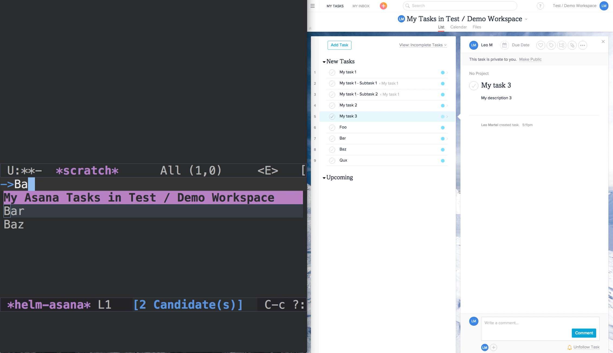

# emacs-asana

Browse and act on your My Tasks list without leaving Emacs!



## Dependencies

You'll need these packages, available from melpa via `M-x package-install`:
```
helm
exec-path-from-shell
```

## Getting Started

Get a Personal Access Token from the `apps' tab in your app.asana.com profile settings.

Set `asana-token`:

```elisp
(setq asana-token "<my-asana-personal-access-token>")
```

Or set the environment variable `asana-token-env-var` (default: `ASANA_TOKEN`):

```bash
export ASANA_TOKEN="<my-asana-personal-access-token>"
```

### Available commands

```elisp
asana-default-workspace-change
asana-create-task
asana-create-task-quickly

asana-helm
asana-helm-my-tasks

asana-org-sync-tasks
asana-org-sync-task-at-point
```

The `asana-helm` task list provides these actions:
```
Select (view task details in buffer) [RET]
Browse (open in Asana) [C-b]
Move to section [C-:]
Complete [C-RET]
Delete [C-DEL]
Move all marked tasks to section [M-:]
Complete all marked tasks [M-RET]
Delete all marked tasks [M-DEL]
```

## Known issues

OSX El Capitan can break `exec-path-from-shell`, which corrupts your access token as it gets imported into Emacs. See https://github.com/purcell/exec-path-from-shell/issues/41 for more details. One available workaround is to disable OSX bash sessions with `touch ~/.bash_sessions_disable`.

## TODO

- **Pagination for > 100 tasks**
- Improve API request batching & async around multi-select and assignee_status updates
- Improve error messages, for example around ASANA_TOKEN not found
- Improve/add docstrings
- Publish v1.0 as package
